# GDSC-Hackfest-2024
<a name="readme-top"></a>


<br />
<div align="center">
  <a href="https://github.com/ValentinoTriadi/RoadEye">
    
  </a>

<h3 align="center">RoadEye</h3>

  <p align="center">
    An delivers AI-based, real-time traffic analysis website
    <br />
    <a href="https://github.com/ValentinoTriadi/RoadEye"><strong>Explore the docs »</strong></a>
    ·
    <a href="https://github.com/ValentinoTriadi/RoadEye/issues">Report Bug</a>
    <br/>
  </p>
</div>


<!-- TABLE OF CONTENTS -->
<details>
  <summary>Table of Contents</summary>
  <ol>
    <li>
      <a href="#about-the-project">About The Project</a>
      <ul>
        <li><a href="#built-with">Built With</a></li>
        <li><a href="#features">Built With</a></li>
      </ul>
    </li>
    <li>
      <a href="#getting-started">Getting Started</a>
      <ul>
        <li><a href="#prerequisites">Prerequisites</a></li>
        <li><a href="#installation">Installation</a></li>
        <li><a href="#usage">Installation</a></li>
      </ul>
    </li>
    <li><a href="#Project-Status">Project Status</a></li>
    <li><a href="#Acknowledgments">Acknowledgments</a></li>
    <li><a href="#Screenshot-STAGE-2">Screenshot STAGE 2</a></li>
    <li><a href="#Screenshot-FINAL-STAGE">Screenshot FINAL STAGE</a></li>
  </ol>
</details>


<!-- ABOUT THE PROJECT -->
## About The Project

[![Home Page][home-screenshot]](https://github.com/ValentinoTriadi/RoadEye)

RoadEye is an advanced traffic monitoring system that leverages artificial intelligence to analyze traffic conditions in real-time, detect accidents promptly, and notify authorities for quick response.
<p align="right">(<a href="#readme-top">back to top</a>)</p>


### Built With

* [![Next][Next.js]][Next-url]
* [![Tailwind][TailwindCSS]][Tailwind-url]
* [![Python][Python]][Python-url]
* [![FastAPI][FastAPI]][FastAPI-url]

<br/>

### Features

* Accident Reports
* New Accident Notification
* CCTV view

<p align="right">(<a href="#readme-top">back to top</a>)</p>


<!-- GETTING STARTED -->
## Getting Started

### Prerequisites
* npm
  ```bash
  cd src
  npm i -g pnpm
  pnpm install
  ```
* Virtual Environment (Optional)
  <a href= #Virtual-Environment>How to Install Virtual Environment</a>
* Python Dependencies
  ```bash
  cd src/api
  pip install -r requirement.txt
  ```


### Installation
1. Clone the repo
   ```sh
   git clone https://github.com/ValentinoTriadi/RoadEye.git
   ```
2. <a href="#Virtual-Environment">Create virtual env (optional)</a>
3. ```sh
   cd src
   ```
4. Install NPM packages
   ```sh
   npm i -g pnpm
   ```
   ```sh
   pnpm install
   ```
5. Install Python dependencies
   ```sh
   cd api
   ```
   ```sh
   pip install -r requirements.txt
   ```


### Usage
   ```sh
   pnpm dev
   ```

<br/>
<br/>

#### Virtual Environment
1. Install virtualenv
   ```sh
   pip install virtualenv
   ```
2. Create venv
   ```sh
   virtualenv venv
   ```
3. activate venv
   ```sh
   venv/Scripts/activate
   ```

<br/>
<br/>
 
<p align="right">(<a href="#readme-top">back to top</a>)</p>


<!-- PROJECT STATUS -->
## Project Status
Project status: *unfinished*
Note: Some fetch link still using temporary fowarding port link

<br/>
<p align="right">(<a href="#readme-top">back to top</a>)</p>


<!-- ACKNOWLEDGMENTS -->
## Acknowledgments
```M2VR```
* ![Maulvi Ziadinda Maulana][Ulvi-Hacker]

[![LinkedIn][linkedin-shield-ulvi]][linkedin-ulvi]
* ![Mohamad Maulana Firdaus Ramadhan][Maul-Hustler]

[![LinkedIn][linkedin-shield-maul]][linkedin-maul]
* ![Valentino Chryslie Triadi][Valen-Hacker]

[![LinkedIn][linkedin-shield-valen]][linkedin-valen]
* ![Rizqi Andhika Pratama][Qie-Hipster]

[![LinkedIn][linkedin-shield-qie]][linkedin-qie]

<br/>
<p align="right">(<a href="#readme-top">back to top</a>)</p>

## Screenshot STAGE 2
* Backend
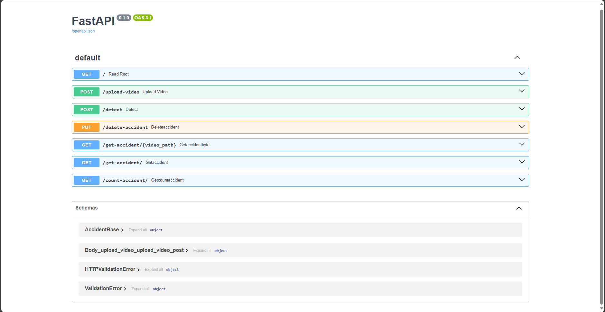
* Frontend
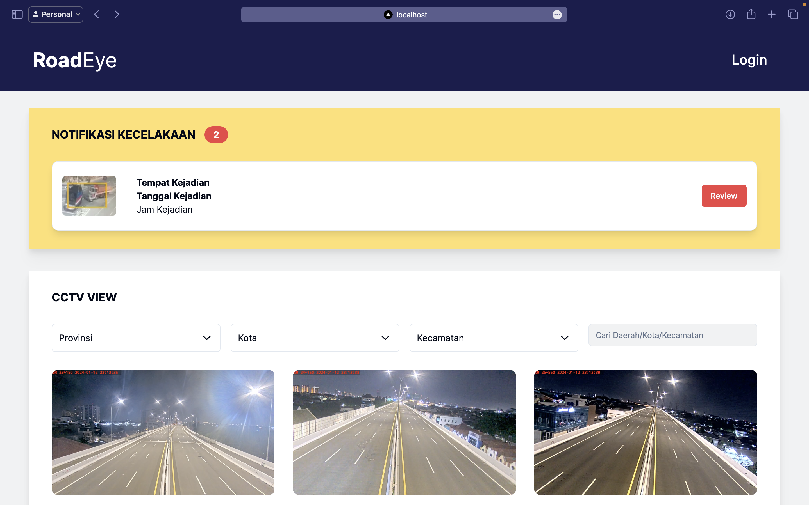
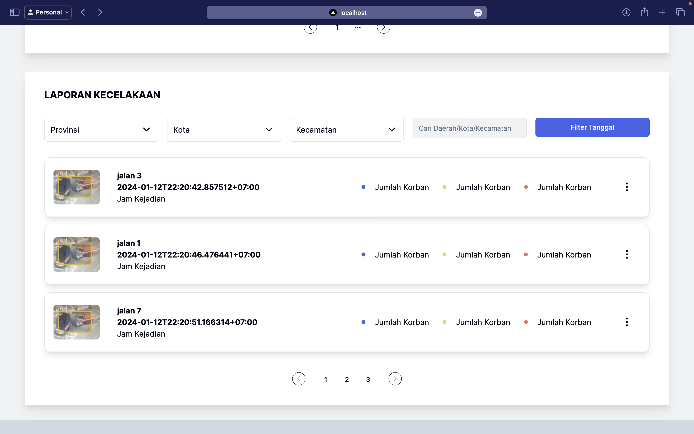

<br/>
<p align="right">(<a href="#readme-top">back to top</a>)</p>

## Screenshot FINAL STAGE
* Machine Learning
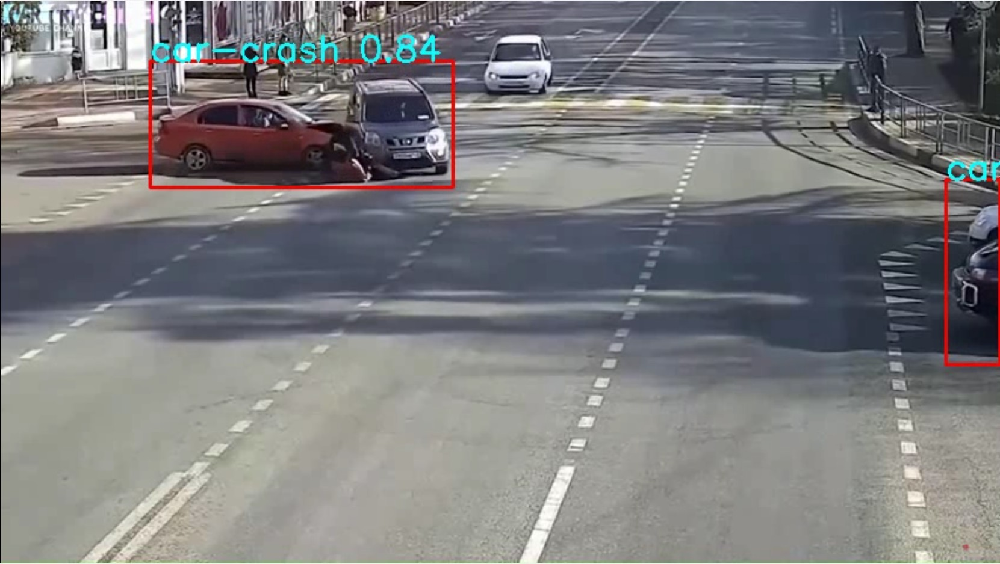
* Backend
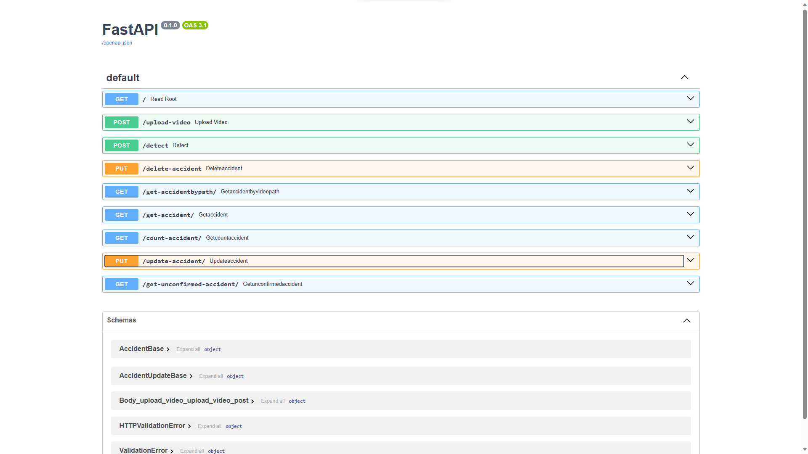
* Frontend
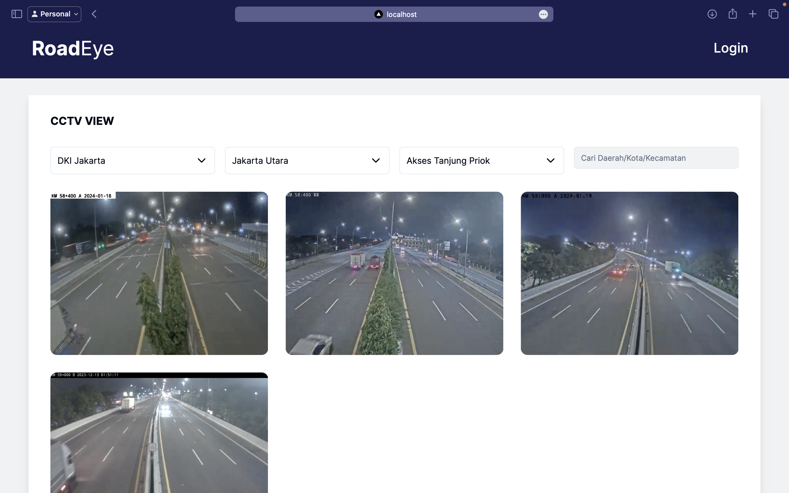
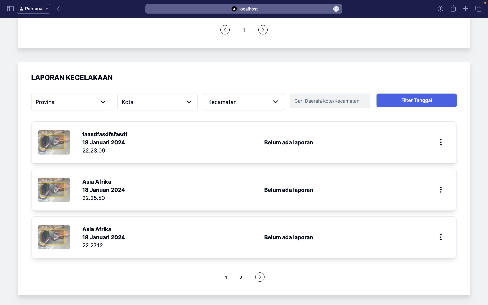
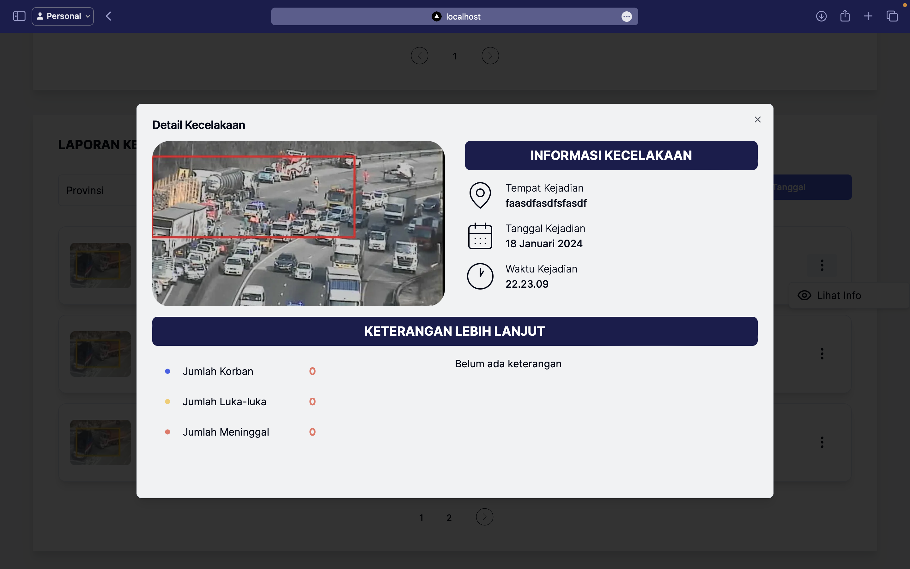
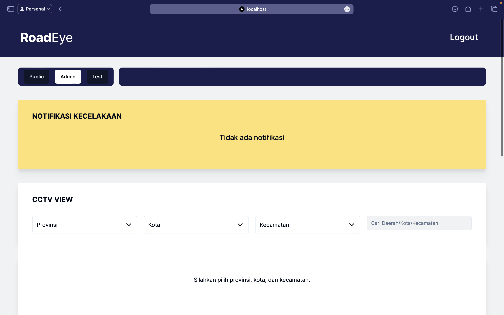
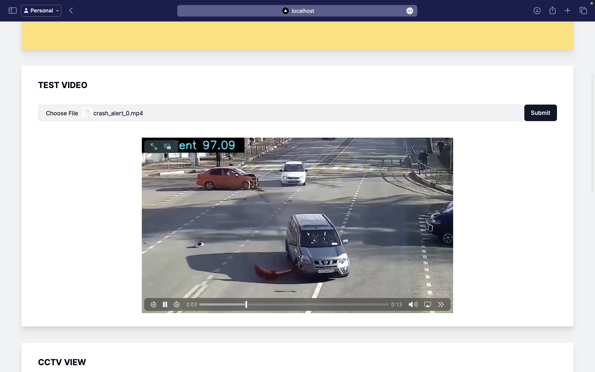
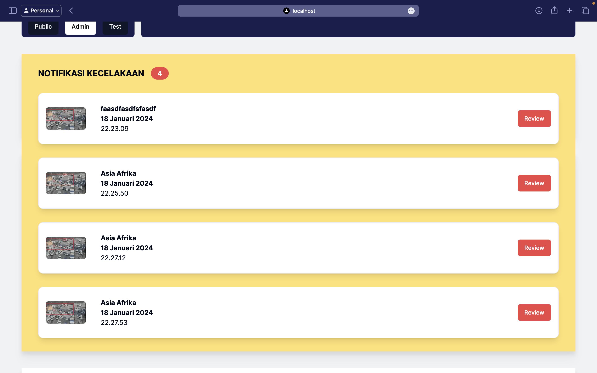
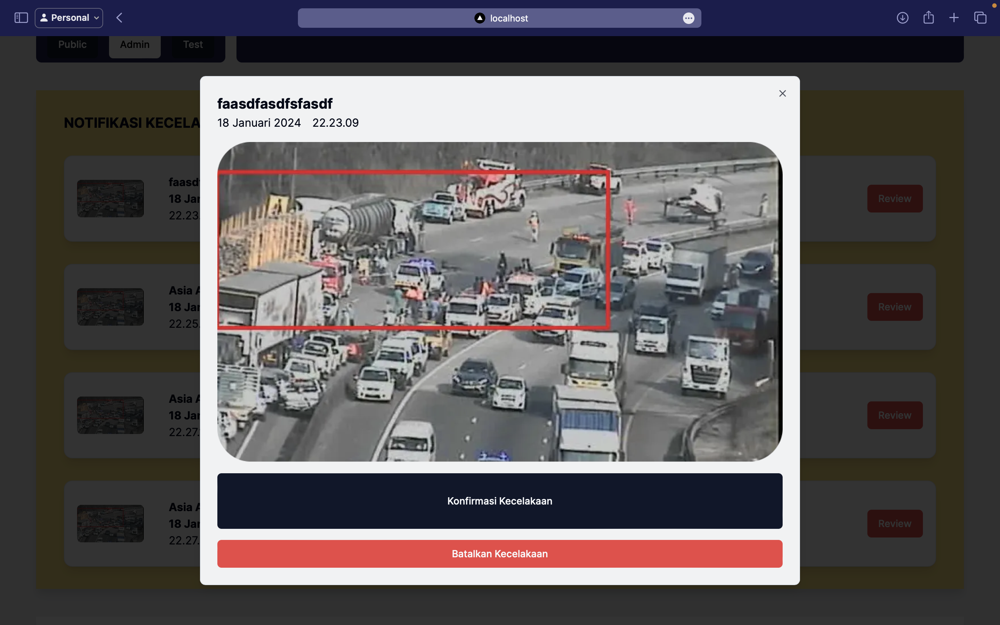


<!-- MARKDOWN LINKS & IMAGES -->
<!-- https://www.markdownguide.org/basic-syntax/#reference-style-links -->
[Next.js]: https://img.shields.io/badge/next.js-000000?style=for-the-badge&logo=nextdotjs&logoColor=white
[Next-url]: https://nextjs.org/
[TailwindCSS]: https://img.shields.io/badge/tailwind-000000?style=for-the-badge&logo=tailwindcss&logoColor=white
[Tailwind-url]: https://tailwindcss.com/
[Python-url]: https://www.python.org/
[Python]: https://img.shields.io/badge/python-000000?style=for-the-badge&logo=python&logoColor=white
[FastAPI-url]: https://fastapi.tiangolo.com/
[FastAPI]: https://img.shields.io/badge/fastapi-000000?style=for-the-badge&logo=fastapi&logoColor=white

[linkedin-shield-valen]: https://img.shields.io/badge/Linkedin-Valentino%20Triadi-000000?style=for-the-badge&logo=linkedin&logoColor=white
[linkedin-valen]: https://linkedin.com/in/valentino-triadi
[linkedin-shield-maul]: https://img.shields.io/badge/Linkedin-Mohamad%20Maulana%20Firdaus%20Ramadhan-000000?style=for-the-badge&logo=linkedin&logoColor=white
[linkedin-maul]: https://www.linkedin.com/in/mohamad-maulana-firdaus-ramadhan/
[linkedin-shield-ulvi]: https://img.shields.io/badge/Linkedin-Maulvi%20Ziadinda%20Maulana-000000?style=for-the-badge&logo=linkedin&logoColor=white
[linkedin-ulvi]: https://www.linkedin.com/in/maulvi-ziadinda-maulana-02b1a5225/
[linkedin-shield-qie]: https://img.shields.io/badge/Linkedin-Rizqi%20Andhika%20Pratama-000000?style=for-the-badge&logo=linkedin&logoColor=white
[linkedin-qie]: https://www.linkedin.com/in/rizqi-andhika-pratama-61a2b126b/

[Next.js]: https://img.shields.io/badge/next.js-000000?style=for-the-badge&logo=nextdotjs&logoColor=white
[Valen-Hacker]: https://img.shields.io/badge/Hacker-%20Valentino%20Chryslie%20Triadi%20-0F172A
[Ulvi-Hacker]: https://img.shields.io/badge/Hacker-%20Maulvi%20Ziadinda%20Maulana%20-0F172A
[Qie-Hipster]: https://img.shields.io/badge/Hipster-%20Rizqi%20Andhika%20Pratama%20-D3DAE5
[Maul-Hustler]: https://img.shields.io/badge/Hustler-%20Mohamad%20Maulana%20Firdaus%20Ramadhan%20-94A3B8
[home-screenshot]:./img/Frontend-1.png